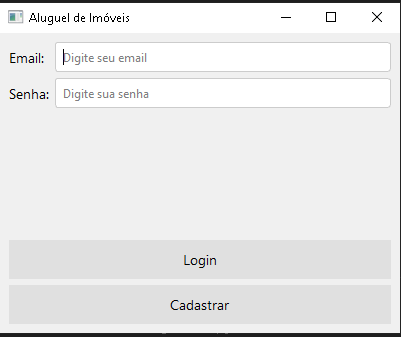
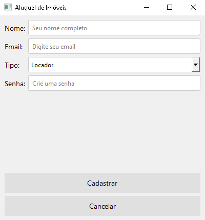
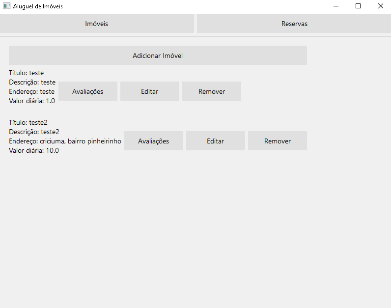
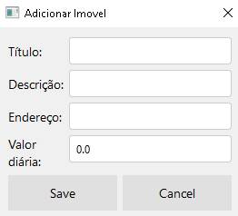
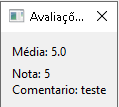
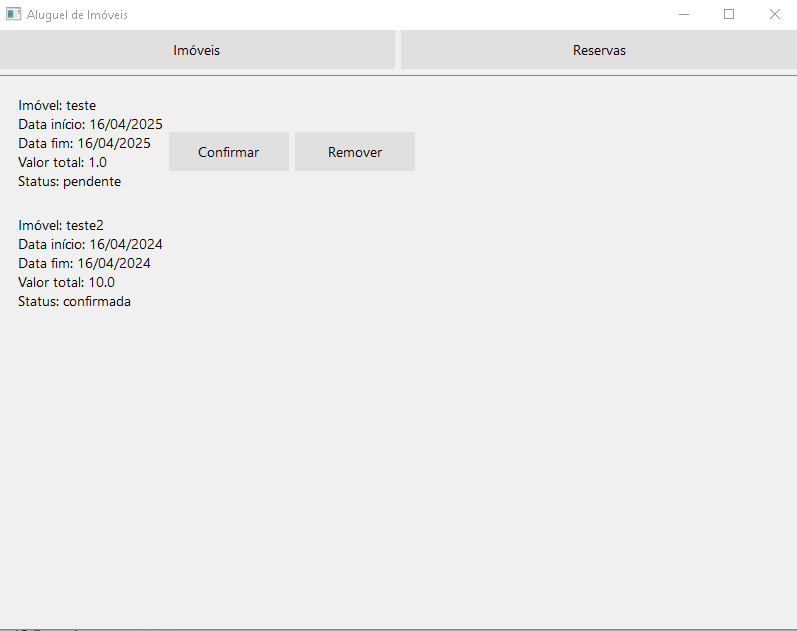
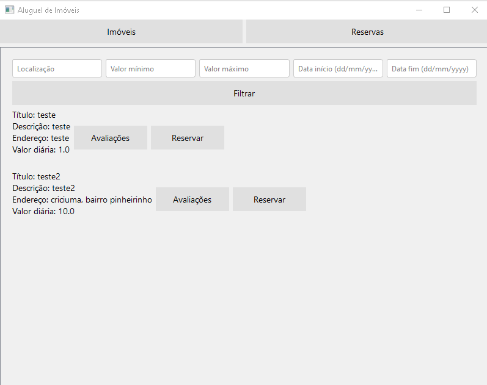
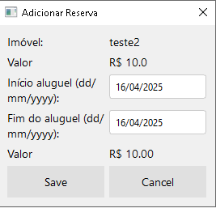
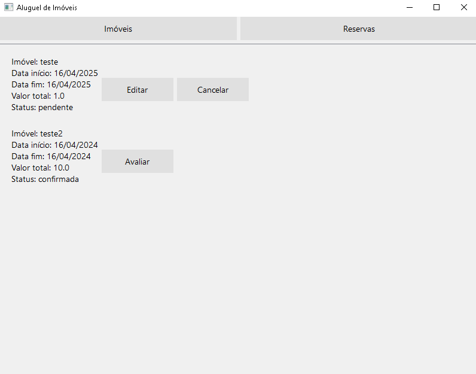
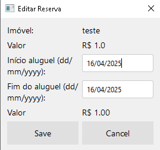

# Sistema de Aluguel de Imóveis de Temporada

## Login

* Entre com email e senha
* Se não possuir conta: clique em cadastrar

## Cadastro

* Preencha os dados e clique em Cadastrar, aparecerá um aviso indicando se funcionou ou não

## Locador

### Imóveis

* Adicionar Imóvel: adiciona um novo imóvel

* Avaliações: mostra a média de nota e lista as avaliações do imóvel correspondente

* Editar Imóvel: edita o imóvel correspondente

* Remover imóvel: remove o imóvel correspondente

### Reservas

* Confirmar: confirma a reserva correspondente
* Remover: remove a reserva correspondente

## Locatário

### Imóveis
* É possível filtrar os imóveis alterando os filtros e clicando em Filtrar

* Avaliações: mostra a média de nota e lista as avaliações do imóvel correspondente

* Reservar: adiciona uma reserva do imóvel correspondente, informando data de início e fim do aluguel

### Reservas

* Editar: edita uma reserva pendente

* Cancelar: cancela uma reserva pendente

* Avaliar: adiciona uma avaliação a uma reserva confirmada após a data final da reserva 